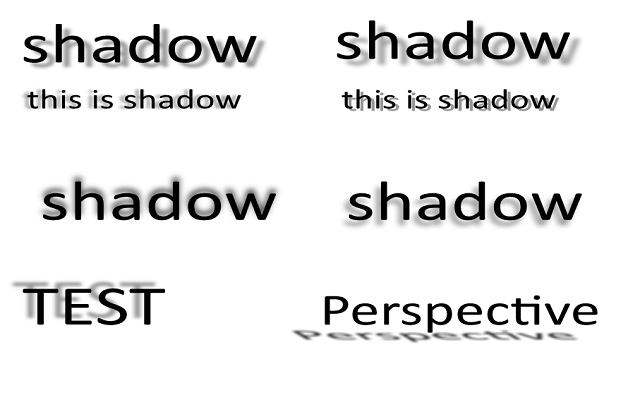
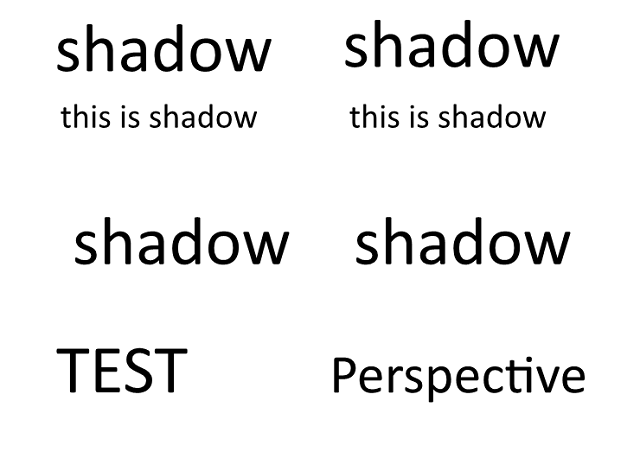






{}

تضم عائلة Aspose.Slides مجموعة من المكتبات القوية عبر لغات البرمجة المختلفة. تعمل هذه المكتبات على تمكين المطورين من إنشاء العروض التقديمية ومعالجتها وتحويلها بسلاسة. سواء كنت تعمل مع .NET، أو Java، أو C++، أو Python، أو PHP، أو Node.js، فإن عائلة Aspose.Slides توفر ميزات أساسية مثل إدارة الشرائح، وتنسيق النص، وتكامل الوسائط المتعددة، والتصدير إلى تنسيقات مختلفة. بغض النظر عن اللغة التي اخترتها، يضمن Aspose.Slides معالجة فعالة ومتعددة الاستخدامات للعروض التقديمية. كما أنه يدعم العديد من الميزات التي لا تتوفر في المنتجات الأخرى، مثل التأثيرات ثنائية وثلاثية الأبعاد، واستيراد وتصدير ملفات PDF، وتصدير الفيديو، وWordArt، والمزيد. في هذه المقالة، سنصف كيف يتفوق Aspose.Slides على المنتجات الأخرى التي تقدم وظائف محدودة ومنخفضة المستوى. سنوضح لك لماذا يعتبر Aspose.Slides هو الخيار الأفضل للعمل مع العروض التقديمية.

{}

{}

إحدى مزايا Aspose.Slides هي أنه يمكنه تصدير العروض التقديمية إلى تنسيقات الفيديو، مثل MP4 أو WEBM، مع دعم الرسوم المتحركة. وهذا يعني أنه يمكنك إنشاء مقاطع فيديو ديناميكية وتفاعلية من العروض التقديمية الخاصة بك، والتي يمكن أن تكون مفيدة لأغراض مختلفة، مثل التعلم عبر الإنترنت أو التسويق أو الترفيه. يمكنك أيضًا تخصيص إعدادات الفيديو، مثل الدقة ومعدل الإطارات والجودة وما إلى ذلك.

ومع ذلك، لا تدعم المنتجات الأخرى تصدير العروض التقديمية إلى الفيديو مع دعم الرسوم المتحركة. يمكنه فقط تصدير العروض التقديمية إلى فيديو بدون رسوم متحركة، مما يعني أن الإخراج سيكون ثابتًا ومملًا. وهذا يعني أنك إذا كنت تريد إنشاء فيديو من العرض التقديمي الخاص بك يحتوي على رسوم متحركة، فلن تتمكن من القيام بذلك باستخدام منتج آخر. سيتعين عليك استخدام أداة أخرى أو تسجيل الشاشة، الأمر الذي قد يكون غير مريح ومنخفض الجودة.

فيما يلي مثال لكيفية قيام Aspose.Slides for .NET <a href="https://docs.aspose.com/slides/net/convert-powerpoint-to-video/">بتصدير عرض تقديمي إلى فيديو</a > مع دعم الرسوم المتحركة. 

{}

{}

ميزة أخرى لـ Aspose.Slides هي أنها تدعم التأثيرات ثنائية وثلاثية الأبعاد للأشكال، مثل الظلال والانعكاسات والتوهجات والمجسمات المجسمة المجسمة والتدوير. يمكن لهذه التأثيرات تحسين مظهر العروض التقديمية وتأثيرها، مما يجعلها أكثر جاذبية واحترافية. يمكنك تطبيق هذه التأثيرات على أي شكل، مثل المستطيلات والدوائر والأسهم والنجوم والمزيد. يمكنك أيضًا تخصيص خصائص هذه التأثيرات، مثل اللون والحجم والزاوية والمسافة والشفافية.

العديد من المنتجات الأخرى غير قادرة على التعامل مع التأثيرات ثنائية وثلاثية الأبعاد للأشكال، وهو ما يمكن لـ Aspose.Slides القيام به. يمكنه فقط عرض خصائص الشكل الأساسية، مثل التعبئة والمخطط التفصيلي والنص. وهذا يعني أنه إذا حاولت تحويل عرض تقديمي يحتوي على تأثيرات ثنائية أو ثلاثية الأبعاد للأشكال، فلن يحافظ الإخراج على المظهر الأصلي والجودة. ستبدو الأشكال مسطحة وباهتة، مما يفقدها جاذبيتها البصرية ومعناها.

فيما يلي مثال لكيفية احتفاظ Aspose.Slides بالتأثيرات ثنائية وثلاثية الأبعاد للنص، بينما لا يفعل ذلك منتج آخر. يحتوي العرض التقديمي الأصلي على نص بتأثير الظل. إن مخرجات Aspose.Slides مطابقة للأصل، في حين أن مخرجات منتج آخر تفتقد التأثيرات.

### إخراج Aspose.Slides (تأثيرات النص):

### إخراج المنتج الآخر (تأثيرات النص):

### العرض التقديمي الأصلي بشكل ذو تأثيرات ثنائية وثلاثية الأبعاد

### إخراج Aspose.Slides (تأثيرات الشكل):

### مخرجات المنتج الآخر (تأثيرات الشكل):

{}

{}

الميزة التالية لـ Aspose.Slides هي أنه يمكنه تصدير العروض التقديمية إلى PDF باستخدام إعدادات توافق PDF المختلفة، مثل PDF/A، وPDF/X، وPDF/UA. تعتبر هذه الإعدادات مهمة للتأكد من أن ملفات PDF الخاصة بك تتوافق مع المعايير والمتطلبات لأغراض مختلفة، مثل الأرشفة أو الطباعة أو إمكانية الوصول. على سبيل المثال، PDF/A هو معيار لحفظ المستندات الإلكترونية على المدى الطويل، وPDF/X هو معيار لمرحلة ما قبل الطباعة والطباعة، وPDF/UA هو معيار للوصول الشامل إلى مستندات PDF.

على عكس Aspose.Slides، لا تستطيع معظم المنتجات الأخرى تصدير العروض التقديمية إلى PDF باستخدام إعدادات توافق PDF المختلفة. يمكنه فقط تصدير العروض التقديمية إلى PDF بالإعدادات الافتراضية، والتي قد لا تكون مناسبة لاحتياجاتك المحددة. وهذا يعني أنه إذا كنت بحاجة إلى إنشاء ملف PDF يتوافق مع معيار أو متطلبات معينة، فلن تتمكن من القيام بذلك مع منتج آخر. سيكون عليك استخدام أداة أخرى أو ضبط الإعدادات يدويًا، الأمر الذي قد يكون معقدًا ومحفوفًا بالمخاطر.

يمكنك استخدام خاصية الامتثال لفئة PdfOptions لتحديد مستوى التوافق المطلوب لمستند PDF الذي تم إنشاؤه. خاصية التوافق هي من النوع PdfCompliance، وهو تعداد يحدد القيم المحتملة لمستوى التوافق مع معايير PDF. يمكنك العثور على مزيد من المعلومات حول تعداد [PdfCompliance](https://reference.aspose.com/slides/net/aspose.slides.export/pdfcompliance/) في Aspose.Slides لمرجع .NET API.

{}

{}

Aspose.Slides هي أداة قوية تسمح لك بتصدير العروض التقديمية إلى HTML مع دعم الرسوم المتحركة للأشكال، مثل التلاشي والتكبير والتصغير والمزيد. هذه الميزة غير متوفرة في العديد من المنتجات الأخرى، مما يجعل Aspose.Slides أداة فريدة وقيمة لإنشاء صفحات ويب تفاعلية وسريعة الاستجابة من العروض التقديمية الخاصة بك.

[إليك مثال](https://github.com/aspose-slides/Aspose.Slides.WebExtensions#basic-usage-example) لكيفية قيام Aspose.Slides for .NET بتصدير عرض تقديمي إلى HTML مع دعم الرسوم المتحركة للأشكال ، في حين أن العديد من المنتجات الأخرى لا تستطيع ذلك. يحتوي العرض التقديمي الأصلي على بعض النصوص والصور والأشكال، مع بعض تأثيرات الحركة، مثل التلاشي والتكبير والتصغير. إن مخرجات Aspose.Slides for .NET هي ملف HTML يحافظ على تأثيرات الرسوم المتحركة، مما يجعل صفحة الويب أكثر جاذبية وحيوية. يكون إخراج العديد من المنتجات الأخرى عبارة عن ملف HTML لا يحتوي على تأثيرات الرسوم المتحركة، مما يجعل صفحة الويب مملة ومسطحة.

لذلك، كما ترون، Aspose.Slides هو المنتج الوحيد الذي يمكنه تصدير العروض التقديمية إلى HTML مع دعم الرسوم المتحركة للأشكال، مما يسمح لك بإنشاء صفحات ويب تفاعلية وسريعة الاستجابة من العروض التقديمية الخاصة بك. 

{}

{}

يتمتع Aspose.Slides بميزة تسمح لك باستيراد ملفات HTML وتحويلها إلى تنسيقات عروض تقديمية، مثل PPT أو PPTX أو ODP. تعد هذه ميزة مفيدة عندما تريد استخدام أو تعديل محتوى ملف HTML بتنسيق عرض تقديمي. على سبيل المثال، قد يكون لديك صفحة HTML تريد عرضها كعرض تقديمي، أو رسالة إخبارية بتنسيق HTML تريد تخصيصها بعلامتك التجارية وتصميمك الخاص.

في المقابل، يمكن للعديد من المنتجات الأخرى تصدير تنسيقات العرض التقديمي إلى HTML فقط، وليس العكس. وهذا يعني أنه إذا كان لديك ملف HTML تريد تحويله إلى تنسيق عرض تقديمي، فلن تتمكن من القيام بذلك باستخدام منتج آخر. سيتعين عليك نسخ المحتوى ولصقه يدويًا، الأمر الذي قد يكون مملاً وعرضة للأخطاء.

{}

{}

يتيح لك Aspose.Slides أيضًا استيراد ملفات PDF وتغييرها إلى تنسيقات العروض التقديمية، مثل PPT أو PPTX أو ODP. هذه ميزة ملائمة عندما تريد العمل مع محتوى ملف PDF أو تحريره بتنسيق عرض تقديمي. على سبيل المثال، قد يكون لديك تقرير PDF تريد عرضه كعرض شرائح، أو كتيب PDF تريد تعديله باستخدام علامتك التجارية وتصميمك الخاص.

ومع ذلك، فإن العديد من المنتجات الأخرى لا تقدم هذا الخيار. يمكنهم فقط تغيير تنسيقات العرض التقديمي إلى PDF، ولكن ليس العكس. وهذا يعني أنه يتعين عليك البحث عن أداة أخرى أو نسخ المحتوى ولصقه يدويًا، الأمر الذي قد يستغرق وقتًا طويلاً وعرضة للأخطاء.

{}

{}

ميزة أخرى لـ Aspose.Slides هي أنه يمكن أن يعمل بشكل صحيح مع WordArt، وهي ميزة تسمح لك بإنشاء وتحرير النص بتأثيرات مختلفة، مثل الشكل واللون والمخطط التفصيلي والظل وثلاثي الأبعاد. يمكن لـ WordArt أن يجعل عروضك التقديمية أكثر جاذبية وتعبيراً، مما يضيف بعض الذوق والشخصية إلى النص الخاص بك. يمكنك إنشاء WordArt وتحريره بتنسيقات العرض التقديمي، مثل PPT أو PPTX أو ODP، مع خيارات متنوعة، مثل الخط والحجم والنمط والمحاذاة.

يمكن لمعظم المنتجات الأخرى عرض خصائص النص الأساسية فقط، مثل التعبئة والمخطط التفصيلي والنص. وهذا يعني أنه إذا حاولت العمل باستخدام عرض تقديمي يحتوي على WordArt، فلن تحافظ المخرجات على المظهر الأصلي والجودة. سيبدو WordArt عاديًا ومملًا، وسيفقد جاذبيته البصرية ومعناه.

فيما يلي مثال لكيفية عمل Aspose.Slides بشكل صحيح مع WordArt، بينما لا يستطيع منتج آخر ذلك. يحتوي العرض التقديمي الأصلي على بعض النصوص ذات تأثيرات WordArt، مثل الشكل واللون والمخطط التفصيلي والظل والأبعاد الثلاثية. إن إخراج Aspose.Slides مطابق للأصل، في حين أن إخراج منتج آخر يفتقد تأثيرات WordArt.

### إخراج Aspose.Slides لـ .NET:

### مخرجات المنتج الآخر:

كما ترون، Aspose.Slides هو المنتج الوحيد الذي يمكنه العمل بشكل صحيح مع WordArt، مما يضمن أن العروض التقديمية الخاصة بك تبدو جيدة كما كان المقصود منها.

{}

{}

الميزة التالية لـ Aspose.Slides هي أنه يمكنه العمل مع تنسيق ODP، وهو معيار مفتوح للعروض التقديمية، تدعمه العديد من التطبيقات، مثل LibreOffice، وOpenOffice، وGoogle Docs. يمكن لـ Aspose.Slides إنشاء ملفات ODP ومعالجتها وتحويلها، مع دعم كامل للجداول والرسوم البيانية. تعد الجداول والرسوم البيانية عناصر مهمة لعرض البيانات والمعلومات بطريقة واضحة وموجزة. يمكنك إنشاء الجداول والمخططات وتحريرها في ملفات ODP، مع خيارات متنوعة، مثل النمط واللون والتخطيط ومصدر البيانات.

لا تدعم العديد من المنتجات الأخرى الجداول والمخططات في ملفات ODP. وهذا يعني أنه إذا حاولت العمل باستخدام ملف ODP يحتوي على جداول أو مخططات، فلن يحافظ الإخراج على المظهر الأصلي والوظيفة. ستكون الجداول والمخططات إما مفقودة أو مشوهة، مما يؤدي إلى فقدان بياناتها ومعناها.

{}

{}

ميزة أخرى لـ Aspose.Slides هي تشغيله المستقر عبر أنظمة التشغيل المختلفة. يعمل Aspose.Slides بسلاسة على أنظمة التشغيل Windows وLinux وmacOS، ويدعم بنيات x86-64 وARM. يتيح لك هذا التنوع إنشاء العروض التقديمية ومعالجتها وتحويلها داخل بيئتك، دون مواجهة أي مشكلات في التوافق أو الأداء.

{}

{}

يعمل فريقنا باستمرار على تحسين منتجات Aspose.Slides. يسعدنا أن نعلن عن العديد من الميزات القادمة، بما في ذلك القدرة على تحويل المعادلات الرياضية إلى تنسيق LaTeX، وتصدير شرائح العرض التقديمي كملفات تعريف، وإضافة ميزة عرض الشرائح لصادرات HTML. بالإضافة إلى ذلك، نقدم دعمًا صوتيًا لتصدير الفيديو وميزة لضغط العروض التقديمية لتسهيل المشاركة والتخزين. كن مطمئنًا، فريق الدعم لدينا متاح على مدار الساعة طوال أيام الأسبوع لتقديم مساعدة عالية الجودة لأية أسئلة أو مشكلات قد تواجهها.

{}

{}

كما ترون، يتمتع Aspose.Slides بالعديد من المزايا مقارنة بالمنتجات الأخرى. هذه المزايا تجعل Aspose.Slides الخيار الأفضل للعمل مع العروض التقديمية، حيث أنه يوفر المزيد من الوظائف والجودة والتوافق مقارنة بالمنتجات الأخرى. علاوة على ذلك، يتمتع Aspose.Slides بسعر معقول يعكس قيمته ومميزاته. قد تجد منتجات أرخص في السوق، لكنها لن توفر لك نفس مستوى الخدمة والرضا الذي توفره Aspose.Slides. يمكنك [تنزيل نسخة تجريبية مجانية](https://products.aspose.com/slides/ar/family/) من Aspose.Slides من موقعنا على الويب وانظر بنفسك كيف يعمل. 

{}


    
