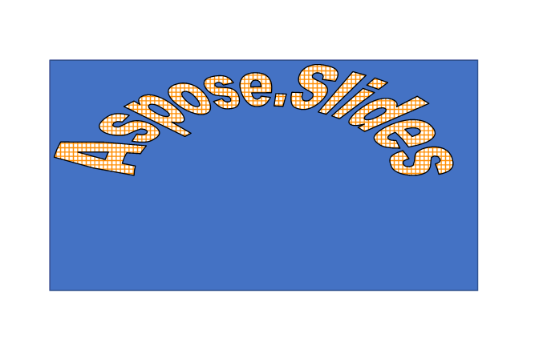






{}

Η οικογένεια Aspose.Slides περιλαμβάνει μια σουίτα ισχυρών βιβλιοθηκών σε διάφορες γλώσσες προγραμματισμού. Αυτές οι βιβλιοθήκες εξουσιοδοτούν τους προγραμματιστές να δημιουργούν, να χειρίζονται και να μετατρέπουν παρουσιάσεις απρόσκοπτα. Είτε εργάζεστε με .NET, Java, C++, Python, PHP ή Node.js, η οικογένεια Aspose.Slides παρέχει βασικές δυνατότητες, όπως διαχείριση διαφανειών, μορφοποίηση κειμένου, ενοποίηση πολυμέσων και εξαγωγή σε διαφορετικές μορφές. Ανεξάρτητα από τη γλώσσα που επιλέξατε, το Aspose.Slides διασφαλίζει αποτελεσματικό και ευέλικτο χειρισμό της παρουσίασης. Υποστηρίζει επίσης πολλές λειτουργίες που δεν είναι διαθέσιμες σε άλλα προϊόντα, όπως εφέ 2D και 3D, εισαγωγή και εξαγωγή PDF, εξαγωγή βίντεο, WordArt και άλλα. Σε αυτό το άρθρο, θα περιγράψουμε πώς το Aspose.Slides υπερέχει από άλλα προϊόντα που προσφέρουν περιορισμένη και κατώτερη λειτουργικότητα. Θα σας δείξουμε γιατί το Aspose.Slides είναι η καλύτερη επιλογή για εργασία με παρουσιάσεις.

{}

{}

Ένα από τα πλεονεκτήματα του Aspose.Slides είναι ότι μπορεί να εξάγει παρουσιάσεις σε μορφές βίντεο, όπως MP4 ή WEBM, με υποστήριξη κινούμενων εικόνων. Αυτό σημαίνει ότι μπορείτε να δημιουργήσετε δυναμικά και διαδραστικά βίντεο από τις παρουσιάσεις σας, τα οποία μπορεί να είναι χρήσιμα για διάφορους σκοπούς, όπως διαδικτυακή μάθηση, μάρκετινγκ ή ψυχαγωγία. Μπορείτε επίσης να προσαρμόσετε τις ρυθμίσεις βίντεο, όπως ανάλυση, ρυθμό καρέ, ποιότητα κ.λπ.

Τα άλλα προϊόντα, ωστόσο, δεν υποστηρίζουν την εξαγωγή παρουσιάσεων σε βίντεο με υποστήριξη κινούμενων εικόνων. Μπορεί να εξάγει μόνο παρουσιάσεις σε βίντεο χωρίς κινούμενα σχέδια, πράγμα που σημαίνει ότι η έξοδος θα είναι στατική και βαρετή. Αυτό σημαίνει ότι εάν θέλετε να δημιουργήσετε ένα βίντεο από την παρουσίασή σας που περιέχει κινούμενα σχέδια, δεν θα μπορείτε να το κάνετε με άλλο προϊόν. Θα πρέπει να χρησιμοποιήσετε άλλο εργαλείο ή να εγγράψετε την οθόνη, κάτι που μπορεί να είναι άβολο και χαμηλής ποιότητας.

Ακολουθεί ένα παράδειγμα του τρόπου με τον οποίο τα Aspose.Slides για .NET μπορούν να <a href="https://docs.aspose.com/slides/net/convert-powerpoint-to-video/">εξάγουν μια παρουσίαση σε βίντεο</a > με υποστήριξη κινουμένων σχεδίων. 

{}

{}

Ένα άλλο πλεονέκτημα του Aspose.Slides είναι ότι υποστηρίζει 2D και 3D εφέ για σχήματα, όπως σκιές, αντανακλάσεις, λάμψεις, λοξοτμήσεις και περιστροφές. Αυτά τα εφέ μπορούν να βελτιώσουν την εμφάνιση και τον αντίκτυπο των παρουσιάσεών σας, καθιστώντας τις πιο ελκυστικές και επαγγελματικές. Μπορείτε να εφαρμόσετε αυτά τα εφέ σε οποιοδήποτε σχήμα, όπως ορθογώνια, κύκλους, βέλη, αστέρια και άλλα. Μπορείτε επίσης να προσαρμόσετε τις ιδιότητες αυτών των εφέ, όπως το χρώμα, το μέγεθος, τη γωνία, την απόσταση και τη διαφάνεια.

Πολλά άλλα προϊόντα δεν μπορούν να χειριστούν εφέ 2D και 3D για σχήματα, κάτι που μπορεί να κάνει το Aspose.Slides. Μπορεί να αποδώσει μόνο τις βασικές ιδιότητες σχήματος, όπως γέμισμα, περίγραμμα και κείμενο. Αυτό σημαίνει ότι εάν προσπαθήσετε να μετατρέψετε μια παρουσίαση που περιέχει εφέ 2D ή 3D για σχήματα, η έξοδος δεν θα διατηρήσει την αρχική εμφάνιση και ποιότητα. Τα σχήματα θα φαίνονται επίπεδα και θαμπά, χάνοντας την οπτική τους γοητεία και νόημα.

Ακολουθεί ένα παράδειγμα του τρόπου με τον οποίο το Aspose.Slides διατηρεί τα εφέ 2D και 3D για κείμενο, ενώ ένα άλλο προϊόν όχι. Η αρχική παρουσίαση περιέχει ένα κείμενο με εφέ σκιάς. Η έξοδος του Aspose.Slides είναι πανομοιότυπη με την αρχική, ενώ στην έξοδο ενός άλλου προϊόντος λείπουν τα εφέ.

### Έξοδος του Aspose.Slides(Εφέ κειμένου):

### Έξοδος του άλλου προϊόντος (Εφέ κειμένου):

### Πρωτότυπη παρουσίαση με σχήμα με 2D και 3D εφέ

### Έξοδος του Aspose.Slides (Εφέ σχήματος):

### Έξοδος του άλλου προϊόντος (Εφέ σχήματος):

{}

{}

Το επόμενο πλεονέκτημα του Aspose.Slides είναι ότι μπορεί να εξάγει παρουσιάσεις σε PDF με διάφορες ρυθμίσεις συμμόρφωσης PDF, όπως PDF/A, PDF/X και PDF/UA. Αυτές οι ρυθμίσεις είναι σημαντικές για τη διασφάλιση ότι τα αρχεία PDF σας πληρούν τα πρότυπα και τις απαιτήσεις για διαφορετικούς σκοπούς, όπως αρχειοθέτηση, εκτύπωση ή προσβασιμότητα. Για παράδειγμα, το PDF/A είναι ένα πρότυπο για τη μακροπρόθεσμη διατήρηση ηλεκτρονικών εγγράφων, το PDF/X είναι ένα πρότυπο για προεκτύπωση και εκτύπωση και το PDF/UA είναι ένα πρότυπο για καθολική προσβασιμότητα εγγράφων PDF.

Σε αντίθεση με το Aspose.Slides, τα περισσότερα άλλα προϊόντα δεν μπορούν να εξάγουν παρουσιάσεις σε PDF με διάφορες ρυθμίσεις συμμόρφωσης PDF. Μπορεί να εξάγει παρουσιάσεις μόνο σε PDF με τις προεπιλεγμένες ρυθμίσεις, οι οποίες μπορεί να μην είναι κατάλληλες για τις συγκεκριμένες ανάγκες σας. Αυτό σημαίνει ότι εάν χρειαστεί να δημιουργήσετε ένα αρχείο PDF που συμμορφώνεται με ένα συγκεκριμένο πρότυπο ή απαίτηση, δεν θα μπορείτε να το κάνετε με άλλο προϊόν. Θα πρέπει να χρησιμοποιήσετε άλλο εργαλείο ή να προσαρμόσετε χειροκίνητα τις ρυθμίσεις, κάτι που μπορεί να είναι περίπλοκο και επικίνδυνο.

Μπορείτε να χρησιμοποιήσετε την ιδιότητα Συμμόρφωση της κλάσης PdfOptions για να καθορίσετε το επιθυμητό επίπεδο συμμόρφωσης για το έγγραφο PDF που δημιουργήθηκε. Η ιδιότητα Συμμόρφωση είναι του τύπου PdfCompliance, η οποία είναι μια απαρίθμηση που καθορίζει τις πιθανές τιμές για το επίπεδο συμμόρφωσης με τα πρότυπα PDF. Μπορείτε να βρείτε περισσότερες πληροφορίες σχετικά με την απαρίθμηση [PdfCompliance](https://reference.aspose.com/slides/net/aspose.slides.export/pdfcompliance/) στην αναφορά Aspose.Slides for .NET API.

{}

{}

Το Aspose.Slides είναι ένα ισχυρό εργαλείο που σας επιτρέπει να εξάγετε παρουσιάσεις σε HTML με υποστήριξη κινούμενων εικόνων για σχήματα, όπως fade, zoom, fly και άλλα. Αυτή η δυνατότητα δεν είναι διαθέσιμη σε πολλά άλλα προϊόντα, καθιστώντας το Aspose.Slides ένα μοναδικό και πολύτιμο εργαλείο για τη δημιουργία διαδραστικών και αποκριτικών ιστοσελίδων από τις παρουσιάσεις σας.

[Εδώ είναι ένα παράδειγμα](https://github.com/aspose-slides/Aspose.Slides.WebExtensions#basic-usage-example) του τρόπου με τον οποίο το Aspose.Slides για .NET μπορεί να εξάγει μια παρουσίαση σε HTML με υποστήριξη κινούμενων εικόνων για σχήματα , ενώ πολλά άλλα προϊόντα δεν μπορούν. Η αρχική παρουσίαση περιέχει κάποιο κείμενο, εικόνες και σχήματα, με κάποια εφέ κινούμενων σχεδίων, όπως fade, zoom και fly. Η έξοδος του Aspose.Slides για .NET είναι ένα αρχείο HTML που διατηρεί τα εφέ κίνησης, κάνοντας την ιστοσελίδα πιο ελκυστική και ζωντανή. Η έξοδος πολλών άλλων προϊόντων είναι ένα αρχείο HTML που δεν περιέχει τα εφέ κίνησης, καθιστώντας την ιστοσελίδα βαρετή και επίπεδη.

Έτσι, όπως μπορείτε να δείτε, το Aspose.Slides είναι το μόνο προϊόν που μπορεί να εξάγει παρουσιάσεις σε HTML με υποστήριξη κινούμενων σχεδίων για σχήματα, επιτρέποντάς σας να δημιουργείτε διαδραστικές και αποκρινόμενες ιστοσελίδες από τις παρουσιάσεις σας. 

{}

{}

Το Aspose.Slides έχει μια δυνατότητα που σας επιτρέπει να εισάγετε αρχεία HTML και να τα μετατρέψετε σε μορφές παρουσίασης, όπως PPT, PPTX ή ODP. Αυτή είναι μια χρήσιμη δυνατότητα όταν θέλετε να χρησιμοποιήσετε ή να τροποποιήσετε το περιεχόμενο ενός αρχείου HTML σε μορφή παρουσίασης. Για παράδειγμα, μπορεί να έχετε μια σελίδα HTML που θέλετε να έχετε ως παρουσίαση ή ένα ενημερωτικό δελτίο HTML που θέλετε να προσαρμόσετε με τη δική σας επωνυμία και σχεδιασμό.

Αντίθετα, πολλά άλλα προϊόντα μπορούν να εξάγουν μόνο μορφές παρουσίασης σε HTML, αλλά όχι το αντίστροφο. Αυτό σημαίνει ότι εάν έχετε ένα αρχείο HTML που θέλετε να μετατρέψετε σε μορφή παρουσίασης, δεν θα μπορείτε να το κάνετε με άλλο προϊόν. Θα πρέπει να αντιγράψετε και να επικολλήσετε το περιεχόμενο με μη αυτόματο τρόπο, κάτι που μπορεί να είναι κουραστικό και επιρρεπές σε σφάλματα.

{}

{}

Το Aspose.Slides σάς επιτρέπει επίσης να εισάγετε αρχεία PDF και να τα αλλάξετε σε μορφές παρουσίασης, όπως PPT, PPTX ή ODP. Αυτή είναι μια βολική λειτουργία όταν θέλετε να εργαστείτε ή να επεξεργαστείτε το περιεχόμενο ενός αρχείου PDF σε μορφή παρουσίασης. Για παράδειγμα, μπορεί να έχετε μια αναφορά PDF που θέλετε να εμφανίσετε ως παρουσίαση ή ένα φυλλάδιο PDF που θέλετε να προσαρμόσετε με τη δική σας επωνυμία και σχεδιασμό.

Ωστόσο, πολλά άλλα προϊόντα δεν προσφέρουν αυτήν την επιλογή. Μπορούν να αλλάξουν μόνο μορφές παρουσίασης σε PDF, αλλά όχι το αντίστροφο. Αυτό σημαίνει ότι πρέπει να αναζητήσετε άλλο εργαλείο ή να αντιγράψετε και να επικολλήσετε το περιεχόμενο με μη αυτόματο τρόπο, κάτι που μπορεί να είναι χρονοβόρο και επιρρεπές σε σφάλματα.

{}

{}

Ένα άλλο πλεονέκτημα του Aspose.Slides είναι ότι μπορεί να λειτουργήσει σωστά με το WordArt, το οποίο είναι μια δυνατότητα που σας επιτρέπει να δημιουργείτε και να επεξεργάζεστε κείμενο με διάφορα εφέ, όπως σχήμα, χρώμα, περίγραμμα, σκιά και 3D. Το WordArt μπορεί να κάνει τις παρουσιάσεις σας πιο ελκυστικές και εκφραστικές, προσθέτοντας κάποια αίσθηση και προσωπικότητα στο κείμενό σας. Μπορείτε να δημιουργήσετε και να επεξεργαστείτε το WordArt σε μορφές παρουσίασης, όπως PPT, PPTX ή ODP, με διάφορες επιλογές, όπως γραμματοσειρά, μέγεθος, στυλ και στοίχιση.

Τα περισσότερα από τα άλλα προϊόντα μπορούν να αποδώσουν μόνο τις βασικές ιδιότητες κειμένου, όπως γέμισμα, περίγραμμα και κείμενο. Αυτό σημαίνει ότι εάν προσπαθήσετε να εργαστείτε με μια παρουσίαση που περιέχει WordArt, το αποτέλεσμα δεν θα διατηρήσει την αρχική εμφάνιση και ποιότητα. Το WordArt θα φαίνεται απλό και βαρετό, χάνοντας την οπτική του γοητεία και νόημα.

Ακολουθεί ένα παράδειγμα του τρόπου με τον οποίο το Aspose.Slides μπορεί να λειτουργήσει σωστά με το WordArt, ενώ ένα άλλο προϊόν δεν μπορεί. Η αρχική παρουσίαση περιέχει κάποιο κείμενο με εφέ WordArt, όπως σχήμα, χρώμα, περίγραμμα, σκιά και 3D. Η έξοδος του Aspose.Slides είναι πανομοιότυπη με την αρχική, ενώ από την έξοδο ενός άλλου προϊόντος λείπουν τα εφέ WordArt.

### Έξοδος Aspose.Slides για .NET:

### Έξοδος του άλλου προϊόντος:

Όπως μπορείτε να δείτε, το Aspose.Slides είναι το μόνο προϊόν που μπορεί να λειτουργήσει σωστά με το WordArt, διασφαλίζοντας ότι οι παρουσιάσεις σας φαίνονται τόσο καλές όσο έπρεπε.

{}

{}

Το επόμενο πλεονέκτημα του Aspose.Slides είναι ότι μπορεί να λειτουργήσει με μορφή ODP, η οποία είναι ένα ανοιχτό πρότυπο για παρουσιάσεις, που υποστηρίζεται από πολλές εφαρμογές, όπως το LibreOffice, το OpenOffice και τα Έγγραφα Google. Το Aspose.Slides μπορεί να δημιουργήσει, να χειριστεί και να μετατρέψει αρχεία ODP, με πλήρη υποστήριξη για πίνακες και γραφήματα. Οι πίνακες και τα γραφήματα είναι σημαντικά στοιχεία για την παρουσίαση δεδομένων και πληροφοριών με σαφή και συνοπτικό τρόπο. Μπορείτε να δημιουργήσετε και να επεξεργαστείτε πίνακες και γραφήματα σε αρχεία ODP, με διάφορες επιλογές, όπως στυλ, χρώμα, διάταξη και πηγή δεδομένων.

Πολλά άλλα προϊόντα δεν υποστηρίζουν πίνακες και γραφήματα σε αρχεία ODP. Αυτό σημαίνει ότι εάν προσπαθήσετε να εργαστείτε με ένα αρχείο ODP που περιέχει πίνακες ή γραφήματα, η έξοδος δεν θα διατηρήσει την αρχική εμφάνιση και λειτουργικότητα. Οι πίνακες και τα γραφήματα είτε θα λείπουν είτε θα παραμορφωθούν, χάνοντας τα δεδομένα και το νόημά τους.

{}

{}

Ένα άλλο πλεονέκτημα του Aspose.Slides είναι η σταθερή λειτουργία του σε διάφορα λειτουργικά συστήματα. Το Aspose.Slides εκτελείται απρόσκοπτα σε πλατφόρμες Windows, Linux και macOS, υποστηρίζοντας και τις δύο αρχιτεκτονικές x86-64 και ARM. Αυτή η ευελιξία σάς επιτρέπει να δημιουργείτε, να χειρίζεστε και να μετατρέπετε παρουσιάσεις στο περιβάλλον σας, χωρίς να αντιμετωπίζετε προβλήματα συμβατότητας ή απόδοσης.

{}

{}

Η ομάδα μας εργάζεται συνεχώς για τη βελτίωση των προϊόντων Aspose.Slides. Είμαστε στην ευχάριστη θέση να ανακοινώσουμε πολλά επερχόμενα χαρακτηριστικά, συμπεριλαμβανομένης της δυνατότητας μετατροπής μαθηματικών εξισώσεων σε μορφή LaTeX, εξαγωγής διαφανειών παρουσίασης ως μετα-αρχείων και προσθήκης δυνατότητας προβολής διαφανειών για εξαγωγές HTML. Επιπλέον, εισάγουμε υποστήριξη ήχου για εξαγωγές βίντεο και μια δυνατότητα συμπίεσης παρουσιάσεων για ευκολότερη κοινή χρήση και αποθήκευση. Να είστε βέβαιοι, η ομάδα υποστήριξής μας είναι διαθέσιμη 24 ώρες το 24ωρο, 7 ημέρες την εβδομάδα, για να παρέχει βοήθεια υψηλής ποιότητας για οποιεσδήποτε ερωτήσεις ή ζητήματα ενδέχεται να αντιμετωπίσετε.

{}

{}

Όπως μπορείτε να δείτε, το Aspose.Slides έχει πολλά πλεονεκτήματα σε σχέση με τα άλλα προϊόντα. Αυτά τα πλεονεκτήματα καθιστούν το Aspose.Slides την καλύτερη επιλογή για εργασία με παρουσιάσεις, καθώς προσφέρει περισσότερη λειτουργικότητα, ποιότητα και συμβατότητα από άλλα προϊόντα. Επιπλέον, το Aspose.Slides έχει μια λογική τιμή που αντικατοπτρίζει την αξία και τα χαρακτηριστικά του. Μπορεί να βρείτε φθηνότερα προϊόντα στην αγορά, αλλά δεν θα σας προσφέρουν το ίδιο επίπεδο εξυπηρέτησης και ικανοποίησης με το Aspose.Slides. Μπορείτε να [κατεβάσετε μια δωρεάν δοκιμαστική έκδοση](https://products.aspose.com/slides/el/family/) του Aspose.Slides από τον ιστότοπό μας και να δείτε μόνοι σας πώς λειτουργεί. 

{}


    
