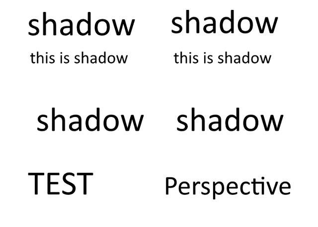
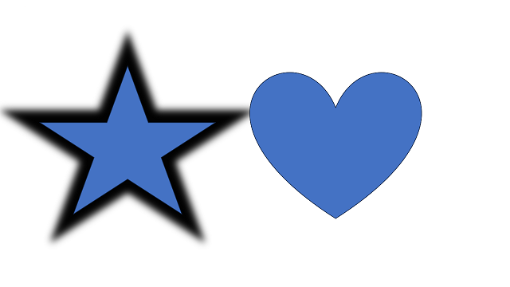
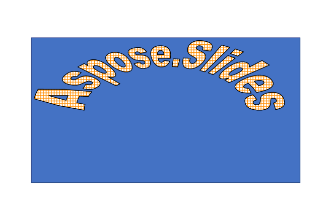






{}

Aspose.Slides is a family of presentation libraries for .NET, Java, C++, Python, PHP, and Node.js. It helps developers create, edit, convert, render, and manage presentations programmatically.

Aspose.Slides supports advanced presentation features such as 2D and 3D effects, PDF import and export, video export workflows, WordArt, ODP tables and charts, and more. This page highlights several areas where Aspose.Slides provides broader presentation-processing capabilities.

{}

{}

Aspose.Slides can generate presentation frames for video export. You can then assemble those frames into video files with tools such as FFmpeg while preserving selected animations and transitions.

However, other products do not support exporting presentations to video with animations. They can only export presentations to video without animations, which means the output will be static and less engaging. This means that if you want to create a video from a presentation that contains animations, you will not be able to do it with another product. You will have to use another tool or record the screen, which can be inconvenient and may result in lower-quality output.

Here is an example of how Aspose.Slides for .NET can <a href="https://docs.aspose.com/slides/net/convert-powerpoint-to-video/">export a presentation to video</a> with animation support.

{}

{}

Another advantage of Aspose.Slides is that it supports 2D and 3D effects for shapes, such as shadows, reflections, glows, bevels, and rotations. These effects can enhance the appearance and impact of your presentations, making them more attractive and professional. You can apply these effects to any shape, such as rectangles, circles, arrows, stars, and more. You can also customize the properties of these effects, such as color, size, angle, distance, and transparency.

Many other products cannot preserve 2D and 3D shape effects during conversion. They can only render the basic shape properties, such as fill, outline, and text. This means that if you try to convert a presentation that contains 2D or 3D effects for shapes, the output will not preserve the original appearance and quality. The shapes will look flat and dull, losing their visual appeal and meaning.

Here is an example of how Aspose.Slides preserves the 2D and 3D effects for text, while another product does not. The original presentation contains text with a shadow effect. The output of Aspose.Slides is identical to the original, while the output of another product is missing the effects.

### Output of Aspose.Slides (Text Effects):

### Output of the other product (Text Effects):

### Original presentation with a shape with 2D and 3D effects

### Output of Aspose.Slides (Shape Effects):

### Output of the other product (Shape Effects):

{}

{}

Aspose.Slides can export presentations to PDF with compliance settings such as PDF/A, PDF/X, and PDF/UA. These settings help PDF files meet requirements for archiving, printing, and accessibility.

Unlike Aspose.Slides, most other products cannot export presentations to PDF with various PDF compliance settings. They can only export presentations to PDF using default settings, which may not be suitable for your specific needs. This means that if you need to create a PDF file that complies with a certain standard or requirement, you will not be able to do it with another product. You will have to use another tool or adjust the settings manually, which can be complicated and risky.

You can use the `Compliance` property of the `PdfOptions` class to specify the desired conformance level for the generated PDF document. The `Compliance` property is of type `PdfCompliance`, which is an enumeration that defines the possible values for the PDF standards compliance level. You can find more information about the [PdfCompliance](https://reference.aspose.com/slides/net/aspose.slides.export/pdfcompliance/) enumeration in the Aspose.Slides for .NET API reference.

{}

{}

Aspose.Slides can export presentations to HTML with shape animation support, including fade, zoom, and fly effects.

[Here is an example](https://github.com/aspose-slides/Aspose.Slides.WebExtensions#basic-usage-example) of how Aspose.Slides for .NET can export a presentation to HTML with animation support for shapes. The original presentation contains text, images, and shapes with animation effects such as fade, zoom, and fly. The output of Aspose.Slides for .NET is an HTML file that preserves the animation effects.

This makes Aspose.Slides suitable for creating interactive HTML output from presentations.

{}

{}

Aspose.Slides can import HTML files and convert them to presentation formats such as PPT, PPTX, and ODP. This is useful when you want to use or modify HTML content in a presentation format, such as an HTML page or newsletter that needs custom branding and design.

In contrast, many other products can only export presentation formats to HTML, but not vice versa. This means that if you have an HTML file that you want to convert to a presentation format, you will not be able to do it with another product. You will have to copy and paste the content manually, which can be tedious and prone to errors.

{}

{}

Aspose.Slides can import PDF files and convert them to presentation formats such as PPT, PPTX, and ODP. This is useful when you want to work with or edit PDF content in a presentation format, such as a report or brochure that needs custom branding and design.

However, many other products do not offer this option. They can only convert presentations to PDF, but not the other way around. This means that you have to look for another tool or copy and paste the content manually, which can be time-consuming and error-prone.

{}

{}

Another advantage of Aspose.Slides is that it can work correctly with WordArt, which is a feature that allows you to create and edit text with various effects, such as shape, color, outline, shadow, and 3D. WordArt can make your presentations more attractive and expressive, adding some flair and personality to your text. You can create and edit WordArt in presentation formats, such as PPT, PPTX, or ODP, with various options, such as font, size, style, and alignment.

Most other products can render only basic text properties, such as fill, outline, and text. This means that if you try to work with a presentation that contains WordArt, the output will not preserve the original appearance and quality. The WordArt will look plain and boring, losing its visual appeal and meaning.

Here is an example of how Aspose.Slides can work correctly with WordArt, while another product cannot. The original presentation contains some text with WordArt effects, such as shape, color, outline, shadow, and 3D. The output of Aspose.Slides is identical to the original, while the output of another product is missing the WordArt effects.

### Output of Aspose.Slides for .NET:

### Output of the other product:

Aspose.Slides preserves WordArt effects so presentations keep their intended appearance.

{}

{}

Another advantage of Aspose.Slides is that it can work with the ODP format, which is an open standard for presentations supported by many applications, such as LibreOffice, OpenOffice, and Google Slides. Aspose.Slides can create, manipulate, and convert ODP files with full support for tables and charts. Tables and charts are important elements for presenting data and information in a clear and concise way. You can create and edit tables and charts in ODP files using various options, such as styles, colors, layouts, and data sources.

Many other products do not support tables and charts in ODP files. This means that if you try to work with an ODP file that contains tables or charts, the output will not preserve the original appearance and functionality. The tables and charts will be either missing or distorted, losing their data and meaning.

{}

{}

Aspose.Slides runs on Windows, Linux, and macOS and supports x86-64 and ARM architectures. This allows you to create, manipulate, and convert presentations in your preferred environment.

{}

{}

The Aspose.Slides team continuously improves the product with new conversion, rendering, compression, and HTML export capabilities. Support is available to help with implementation questions and issues.

{}

{}

Aspose.Slides provides broad format support, rendering quality, cross-platform compatibility, and advanced presentation features. You can [download a free trial version](https://products.aspose.com/slides/family/) and evaluate it in your own workflow.

{}




