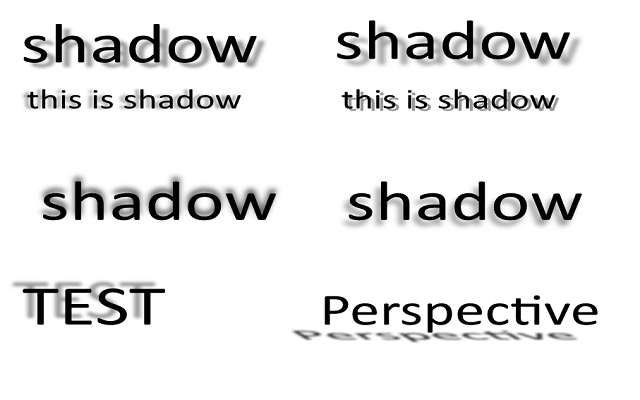
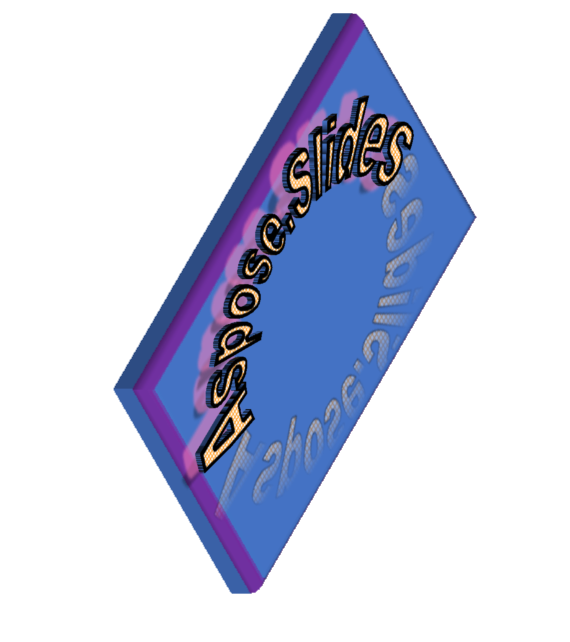






{}

Aspose.Slides is a family of presentation libraries for .NET, Java, C++, Python, PHP, and Node.js. It helps developers create, edit, convert, render, and manage presentations programmatically.

Aspose.Slides supports advanced presentation features such as 2D and 3D effects, PDF import and export, video export workflows, WordArt, ODP tables and charts, and more. This page highlights several of its presentation-processing capabilities.

{}

{}

Aspose.Slides can generate presentation frames for video export. You can then assemble those frames into video files with tools such as FFmpeg while preserving selected animations and transitions.

Here is an example of how Aspose.Slides for .NET can <a href="https://docs.aspose.com/slides/net/convert-powerpoint-to-video/">export a presentation to video</a> with animation support.

{}

{}

Aspose.Slides supports 2D and 3D effects for shapes, such as shadows, reflections, glows, bevels, and rotations. These effects can enhance the appearance and impact of your presentations. You can apply them to shapes such as rectangles, circles, arrows, and stars, and customize properties such as color, size, angle, distance, and transparency.

The following examples show how Aspose.Slides renders text shadows and shape effects from a presentation.

### Output of Aspose.Slides (Text Effects):

### Original presentation with a shape with 2D and 3D effects

### Output of Aspose.Slides (Shape Effects):

{}

{}

Aspose.Slides can export presentations to PDF with compliance settings such as PDF/A, PDF/X, and PDF/UA. These settings help PDF files meet requirements for archiving, printing, and accessibility.

You can use the `Compliance` property of the `PdfOptions` class to specify the desired conformance level for the generated PDF document. The `Compliance` property is of type `PdfCompliance`, which is an enumeration that defines the possible values for the PDF standards compliance level. You can find more information about the [PdfCompliance](https://reference.aspose.com/slides/net/aspose.slides.export/pdfcompliance/) enumeration in the Aspose.Slides for .NET API reference.

{}

{}

Aspose.Slides can export presentations to HTML with shape animation support, including fade, zoom, and fly effects.

[Here is an example](https://github.com/aspose-slides/Aspose.Slides.WebExtensions#basic-usage-example) of how Aspose.Slides for .NET can export a presentation to HTML with animation support for shapes. The original presentation contains text, images, and shapes with animation effects such as fade, zoom, and fly. The output of Aspose.Slides for .NET is an HTML file that preserves the animation effects.

This makes Aspose.Slides suitable for creating interactive HTML output from presentations.

{}

{}

Aspose.Slides can import HTML files and convert them to presentation formats such as PPT, PPTX, and ODP. This is useful when you want to use or modify HTML content in a presentation format, such as an HTML page or newsletter that needs custom branding and design.

{}

{}

Aspose.Slides can import PDF files and convert them to presentation formats such as PPT, PPTX, and ODP. This is useful when you want to work with or edit PDF content in a presentation format, such as a report or brochure that needs custom branding and design.

{}

{}

Aspose.Slides can work with WordArt, which allows text to use effects such as shape, color, outline, shadow, and 3D. You can create and edit WordArt in presentation formats such as PPT, PPTX, and ODP, with options including font, size, style, and alignment.

The following example shows WordArt rendered by Aspose.Slides with shape, color, outline, shadow, and 3D effects.

### Output of Aspose.Slides for .NET:

Aspose.Slides preserves WordArt effects so presentations keep their intended appearance.

{}

{}

Aspose.Slides can work with the ODP format, an open standard for presentations supported by applications such as LibreOffice, OpenOffice, and Google Slides. It can create, manipulate, and convert ODP files, including presentations containing tables and charts. You can create and edit these elements using options such as styles, colors, layouts, and data sources.

{}

{}

Aspose.Slides runs on Windows, Linux, and macOS and supports x86-64 and ARM architectures. This allows you to create, manipulate, and convert presentations in your preferred environment.

{}

{}

The Aspose.Slides team continuously improves the product with new conversion, rendering, compression, and HTML export capabilities. Support is available to help with implementation questions and issues.

{}

{}

Aspose.Slides provides broad format support, rendering quality, cross-platform compatibility, and advanced presentation features. You can [download a free trial version](https://products.aspose.com/slides/family/) and evaluate it in your own workflow.

{}




