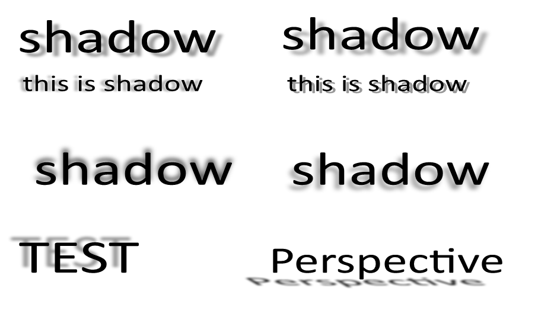
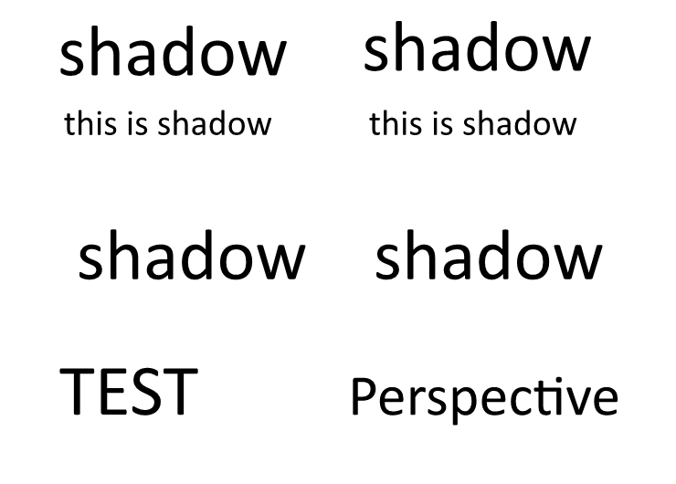






{}
Aspose.Slides for .NET is a powerful and versatile library that allows you to create, manipulate, and convert presentations in various formats, such as PPT, PPTX, ODP, PDF, HTML, and more. It also supports many features that are not available in other products, such as 2D and 3D effects, PDF import and export, video export, WordArt, and more. In this article, we will describe how Aspose.Slides for .NET outperforms other products that offer limited and inferior functionality. We will show you why Aspose.Slides for .NET is the best choice for working with presentations in .NET applications.

{}

{}

One of the advantages of Aspose.Slides for .NET is that it can export presentations to video formats, such as MP4 or WEBM, with animation support. This means that you can create dynamic and interactive videos from your presentations, which can be useful for various purposes, such as online learning, marketing, or entertainment. You can also customize the video settings, such as resolution, frame rate, quality, and etc.

The other products, however, does not support exporting presentations to video with animation support. It can only export presentations to video without animation, which means that the output will be static and boring. This means that if you want to create a video from your presentation that contains animation, you will not be able to do it with the `other product`. You will have to use another tool or record the screen, which can be inconvenient and low-quality.

Here is an example of how Aspose.Slides for .NET can <a href="https://docs.aspose.com/slides/net/convert-powerpoint-to-video/">export a presentation to video</a> with animation support. 

{}

{}

Another advantage of Aspose.Slides for .NET is that it supports 2D and 3D effects for shapes, such as shadows, reflections, glows, bevels, and rotations. These effects can enhance the appearance and impact of your presentations, making them more attractive and professional. You can apply these effects to any shape, such as rectangles, circles, arrows, stars, and more. You can also customize the properties of these effects, such as color, size, angle, distance, and transparency.

Many other products are unable to handle 2D and 3D effects for shapes, which Aspose.Slides for .NET can do. It can only render the basic shape properties, such as fill, outline, and text. This means that if you try to convert a presentation that contains 2D or 3D effects for shapes, the output will not preserve the original appearance and quality. The shapes will look flat and dull, losing their visual appeal and meaning.

Here is an example of how Aspose.Slides for .NET preserves the 2D and 3D effects for text, while the `other product` does not. The original presentation contains a text with a shadow effect. The output of Aspose.Slides for .NET is identical to the original, while the output of the `other product` is missing the effects.

### Output of Aspose.Slides for .NET:

### Output of the other product:

{}

{}

The next advantage of Aspose.Slides for .NET is that it can export presentations to PDF with various PDF compliance settings, such as PDF/A, PDF/X, and PDF/UA. These settings are important for ensuring that your PDF files meet the standards and requirements for different purposes, such as archiving, printing, or accessibility. For example, PDF/A is a standard for long-term preservation of electronic documents, PDF/X is a standard for prepress and printing, and PDF/UA is a standard for universal accessibility of PDF documents.

Unlike Aspose.Slides for .NET, the most of other products cannot export presentations to PDF with various PDF compliance settings. It can only export presentations to PDF with the default settings, which may not be suitable for your specific needs. This means that if you need to create a PDF file that complies with a certain standard or requirement, you will not be able to do it with the `other product`. You will have to use another tool or manually adjust the settings, which can be complicated and risky.

You can use the Compliance property of the PdfOptions class to specify the desired conformance level for the generated PDF document. The Compliance property is of type PdfCompliance, which is an enumeration that defines the possible values for the PDF standards compliance level. You can find more information about the [PdfCompliance](https://reference.aspose.com/slides/net/aspose.slides.export/pdfcompliance/) enumeration in the Aspose.Slides for .NET API reference.

{}

{}

Aspose.Slides for .NET is a powerful tool that allows you to export presentations to HTML with animation support for shapes, such as fade, zoom, fly, and more. This feature is not available in many other products, making Aspose.Slides for .NET a unique and valuable tool for creating interactive and responsive web pages from your presentations.

[Here is an example](https://github.com/aspose-slides/Aspose.Slides.WebExtensions#basic-usage-example) of how Aspose.Slides for .NET can export a presentation to HTML with animation support for shapes, while many other products cannot. The original presentation contains some text, images, and shapes, with some animation effects, such as fade, zoom, and fly. The output of Aspose.Slides for .NET is an HTML file that preserves the animation effects, making the web page more engaging and lively. The output of many other products is a HTML file that does not contain the animation effects, making the web page dull and flat.

So, as you can see, Aspose.Slides for .NET is the only product that can export presentations to HTML with animation support for shapes, allowing you to create interactive and responsive web pages from your presentations. 

{}

{}

Aspose.Slides for .NET has a feature that allows you to import HTML files and transform them into presentation formats, such as PPT, PPTX, or ODP. This is a useful feature when you want to use or modify the content of an HTML file in a presentation format. For example, you might have an HTML page that you want to have as a presentation, or an HTML newsletter that you want to customize with your own branding and design.

In contrast, many other products can only export presentation formats to HTML, but not vice versa. This means that if you have an HTML file that you want to convert to a presentation format, you will not be able to do it with the `other product`. You will have to copy and paste the content manually, which can be tedious and prone to errors.

{}

{}

Aspose.Slides for .NET also allows you to import PDF files and change them into presentation formats, such as PPT, PPTX, or ODP. This is a convenient feature when you want to work with or edit the content of a PDF file in a presentation format. For example, you may have a PDF report that you want to display as a slideshow, or a PDF brochure that you want to adjust with your own branding and design.

However, many other products do not offer this option. They can only change presentation formats into PDF, but not the other way around. This means that you have to look for another tool or copy and paste the content manually, which can be time-consuming and error-prone.

{}

{}

Another advantage of Aspose.Slides for .NET is that it can work correctly with WordArt, which is a feature that allows you to create and edit text with various effects, such as shape, color, outline, shadow, and 3D. WordArt can make your presentations more attractive and expressive, adding some flair and personality to your text. You can create and edit WordArt in presentation formats, such as PPT, PPTX, or ODP, with various options, such as font, size, style, and alignment.

The most of the other products can only render the basic text properties, such as fill, outline, and text. This means that if you try to work with a presentation that contains WordArt, the output will not preserve the original appearance and quality. The WordArt will look plain and boring, losing its visual appeal and meaning.

Here is an example of how Aspose.Slides for .NET can work correctly with WordArt, while the `other product` cannot. The original presentation contains some text with WordArt effects, such as shape, color, outline, shadow, and 3D. The output of Aspose.Slides for .NET is identical to the original, while the output of the `other product` is missing the WordArt effects.

### Output of Aspose.Slides for .NET:

### Output of the other product:

As you can see, Aspose.Slides for .NET is the only product that can work correctly with WordArt, ensuring that your presentations look as good as they were intended.

{}

{}

Next advantage of Aspose.Slides for .NET is that it can work with ODP format, which is an open standard for presentations, supported by many applications, such as LibreOffice, OpenOffice, and Google Docs. Aspose.Slides for .NET can create, manipulate, and convert ODP files, with full support for tables and charts. Tables and charts are important elements for presenting data and information in a clear and concise way. You can create and edit tables and charts in ODP files, with various options, such as style, color, layout, and data source.

Many other products do not support tables and charts in ODP files. This means that if you try to work with an ODP file that contains tables or charts, the output will not preserve the original appearance and functionality. The tables and charts will be either missing or distorted, losing their data and meaning.

{}

{}

Another advantage of Aspose.Slides for .NET is that it can work stably in Linux environment, which is a popular and widely used operating system for servers, desktops, and devices. Aspose.Slides for .NET can run on Linux platforms, such as Ubuntu, CentOS, or Debian, with the help of .NET Core (which is a cross-platform version of .NET Framework) or .NET6. This means that you can use Aspose.Slides for .NET to create, manipulate, and convert presentations in Linux environment, without any compatibility or performance issues.

{}

{}

It is important to work on the development of a product because it helps to keep the product relevant and competitive in the market. Adding new features and improving existing ones can help to attract new customers and retain existing ones. It also helps to keep up with the latest trends and technologies, which can be important for staying ahead of the competition. By constantly working on the development of Aspose.Slides for .NET, we are able to provide our customers with a versatile and reliable tool that can help them create stunning presentations with ease. I hope this information is helpful. Let me know if you have any other questions.

Our team is constantly working to improve Aspose.Slides for .NET. We have plans to implement support for: convert math equations to LaTeX, export presentation slides to metafiles, add a slideshow feature to export to HTML, add audio support for export to video, and compress presentation feature, among other things. We are committed to providing high-quality support to all of our customers, and our support team is available 24/7 to assist you with any questions or issues you may have.

{}

{}

As you can see, Aspose.Slides for .NET has many advantages over the other products, such as full support for 2D and 3D effects for shapes, import from PDF format to presentation format, export to video with animation support, correct work with ODP format, import from HTML format, correct work with WordArt, and stable work in Linux environment. These advantages make Aspose.Slides for .NET the best choice for working with presentations in .NET applications, as it offers more functionality, quality, and compatibility than the other products. Moreover, Aspose.Slides for .NET has a reasonable price that reflects its value and features. You may find cheaper products on the market, but they will not provide you with the same level of service and satisfaction as Aspose.Slides for .NET. Therefore, we recommend you to choose Aspose.Slides for .NET for your presentation needs, and enjoy the benefits of a powerful and versatile library. You can [download a free trial version](https://products.aspose.com/slides/net/) of Aspose.Slides for .NET from our website and see for yourself how it works. Thank you for reading this article and we hope you found it helpful.

{}


    
