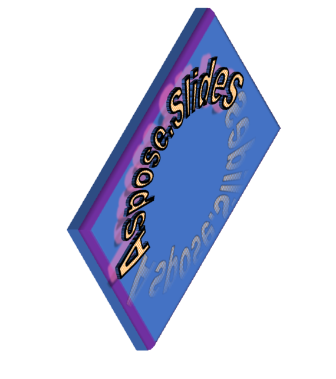






{}

Aspose.Slides परिवार में विभिन्न प्रोग्रामिंग भाषाओं में शक्तिशाली पुस्तकालयों का एक सूट शामिल है। ये लाइब्रेरी डेवलपर्स को प्रस्तुतियों को निर्बाध रूप से बनाने, हेरफेर करने और परिवर्तित करने के लिए सशक्त बनाती हैं। चाहे आप .NET, Java, C++, Python, PHP, या Node.js के साथ काम कर रहे हों, Aspose.Slides परिवार स्लाइड प्रबंधन, टेक्स्ट फ़ॉर्मेटिंग, मल्टीमीडिया एकीकरण और विभिन्न प्रारूपों में निर्यात जैसी आवश्यक सुविधाएँ प्रदान करता है। आपकी चुनी गई भाषा के बावजूद, Aspose.Slides कुशल और बहुमुखी प्रस्तुति प्रबंधन सुनिश्चित करता है। यह कई सुविधाओं का भी समर्थन करता है जो अन्य उत्पादों में उपलब्ध नहीं हैं, जैसे 2डी और 3डी प्रभाव, पीडीएफ आयात और निर्यात, वीडियो निर्यात, वर्डआर्ट, और बहुत कुछ। इस लेख में, हम बताएंगे कि कैसे Aspose.Slides सीमित और निम्न कार्यक्षमता प्रदान करने वाले अन्य उत्पादों से बेहतर प्रदर्शन करता है। हम आपको दिखाएंगे कि प्रस्तुतियों के साथ काम करने के लिए Aspose.Slides सबसे अच्छा विकल्प क्यों है।

{}

{}

Aspose.Slides का एक लाभ यह है कि यह एनिमेशन समर्थन के साथ प्रस्तुतियों को MP4 या WEBM जैसे वीडियो प्रारूपों में निर्यात कर सकता है। इसका मतलब है कि आप अपनी प्रस्तुतियों से गतिशील और इंटरैक्टिव वीडियो बना सकते हैं, जो ऑनलाइन सीखने, मार्केटिंग या मनोरंजन जैसे विभिन्न उद्देश्यों के लिए उपयोगी हो सकते हैं। आप वीडियो सेटिंग्स को भी कस्टमाइज़ कर सकते हैं, जैसे रिज़ॉल्यूशन, फ़्रेम दर, गुणवत्ता, आदि।

हालाँकि, अन्य उत्पाद एनीमेशन समर्थन के साथ प्रस्तुतियों को वीडियो में निर्यात करने का समर्थन नहीं करते हैं। यह बिना एनीमेशन के केवल प्रस्तुतियों को वीडियो में निर्यात कर सकता है, जिसका अर्थ है कि आउटपुट स्थिर और उबाऊ होगा। इसका मतलब यह है कि यदि आप अपनी प्रस्तुति से एक वीडियो बनाना चाहते हैं जिसमें एनीमेशन शामिल है, तो आप इसे किसी अन्य उत्पाद के साथ नहीं कर पाएंगे। आपको किसी अन्य टूल का उपयोग करना होगा या स्क्रीन रिकॉर्ड करना होगा, जो असुविधाजनक और निम्न-गुणवत्ता वाला हो सकता है।

यहां एक उदाहरण दिया गया है कि कैसे .NET के लिए Aspose.Slides <a href='https://docs.aspose.com/slides/net/convert-powerpoint-to-video/'>एक प्रेजेंटेशन को वीडियो में निर्यात कर सकता है</a > एनीमेशन समर्थन के साथ। 

{}

{}

Aspose.Slides का एक अन्य लाभ यह है कि यह छाया, प्रतिबिंब, चमक, बेवल और घुमाव जैसी आकृतियों के लिए 2डी और 3डी प्रभावों का समर्थन करता है। ये प्रभाव आपकी प्रस्तुतियों की उपस्थिति और प्रभाव को बढ़ा सकते हैं, जिससे वे अधिक आकर्षक और पेशेवर बन सकते हैं। आप इन प्रभावों को किसी भी आकार पर लागू कर सकते हैं, जैसे आयत, वृत्त, तीर, तारे और बहुत कुछ। आप इन प्रभावों के गुणों को भी अनुकूलित कर सकते हैं, जैसे रंग, आकार, कोण, दूरी और पारदर्शिता।

कई अन्य उत्पाद आकृतियों के लिए 2D और 3D प्रभावों को संभालने में असमर्थ हैं, जो Aspose.Slides कर सकता है। यह केवल मूल आकार गुणों, जैसे भरण, रूपरेखा और पाठ को प्रस्तुत कर सकता है। इसका मतलब यह है कि यदि आप किसी प्रस्तुति को परिवर्तित करने का प्रयास करते हैं जिसमें आकृतियों के लिए 2डी या 3डी प्रभाव शामिल हैं, तो आउटपुट मूल स्वरूप और गुणवत्ता को संरक्षित नहीं करेगा। आकृतियाँ सपाट और नीरस दिखेंगी और अपनी दृश्य अपील और अर्थ खो देंगी।

यहां एक उदाहरण दिया गया है कि कैसे Aspose.Slides टेक्स्ट के लिए 2D और 3D प्रभावों को सुरक्षित रखता है, जबकि अन्य उत्पाद ऐसा नहीं करता है। मूल प्रस्तुति में छाया प्रभाव वाला एक पाठ शामिल है। Aspose.Slides का आउटपुट मूल के समान है, जबकि दूसरे उत्पाद के आउटपुट में प्रभाव गायब है।

### Aspose.Slides (पाठ प्रभाव) का आउटपुट:

### अन्य उत्पाद का आउटपुट (पाठ प्रभाव):

### 2डी और 3डी प्रभाव वाली आकृति के साथ मूल प्रस्तुति

### Aspose.Slides (आकार प्रभाव) का आउटपुट:

### अन्य उत्पाद का आउटपुट (आकार प्रभाव):

{}

{}

Aspose.Slides का अगला लाभ यह है कि यह विभिन्न पीडीएफ अनुपालन सेटिंग्स, जैसे पीडीएफ/ए, पीडीएफ/एक्स और पीडीएफ/यूए के साथ प्रस्तुतियों को पीडीएफ में निर्यात कर सकता है। ये सेटिंग्स यह सुनिश्चित करने के लिए महत्वपूर्ण हैं कि आपकी पीडीएफ फाइलें विभिन्न उद्देश्यों, जैसे संग्रह, मुद्रण या पहुंच के लिए मानकों और आवश्यकताओं को पूरा करती हैं। उदाहरण के लिए, पीडीएफ/ए इलेक्ट्रॉनिक दस्तावेजों के दीर्घकालिक संरक्षण के लिए एक मानक है, पीडीएफ/एक्स प्रीप्रेस और प्रिंटिंग के लिए एक मानक है, और पीडीएफ/यूए पीडीएफ दस्तावेजों की सार्वभौमिक पहुंच के लिए एक मानक है।

Aspose.Slides के विपरीत, अधिकांश अन्य उत्पाद विभिन्न पीडीएफ अनुपालन सेटिंग्स के साथ प्रस्तुतियों को पीडीएफ में निर्यात नहीं कर सकते हैं। यह केवल डिफ़ॉल्ट सेटिंग्स के साथ प्रस्तुतियों को पीडीएफ में निर्यात कर सकता है, जो आपकी विशिष्ट आवश्यकताओं के लिए उपयुक्त नहीं हो सकता है। इसका मतलब यह है कि यदि आपको एक पीडीएफ फाइल बनाने की ज़रूरत है जो एक निश्चित मानक या आवश्यकता का अनुपालन करती है, तो आप इसे किसी अन्य उत्पाद के साथ नहीं कर पाएंगे। आपको किसी अन्य टूल का उपयोग करना होगा या सेटिंग्स को मैन्युअल रूप से समायोजित करना होगा, जो जटिल और जोखिम भरा हो सकता है।

आप जेनरेट किए गए पीडीएफ दस्तावेज़ के लिए वांछित अनुरूपता स्तर निर्दिष्ट करने के लिए पीडीएफऑप्शंस वर्ग की अनुपालन संपत्ति का उपयोग कर सकते हैं। अनुपालन संपत्ति पीडीएफ अनुपालन प्रकार की है, जो एक गणना है जो पीडीएफ मानकों के अनुपालन स्तर के लिए संभावित मूल्यों को परिभाषित करती है। आप .NET API संदर्भ के लिए Aspose.Slides में [PdfCompliance](https://reference.aspose.com/slides/net/aspose.slides.export/pdfcompliance/) गणना के बारे में अधिक जानकारी पा सकते हैं।

{}

{}

Aspose.Slides एक शक्तिशाली उपकरण है जो आपको फीका, ज़ूम, फ़्लाई और अन्य आकृतियों के लिए एनीमेशन समर्थन के साथ प्रस्तुतियों को HTML में निर्यात करने की अनुमति देता है। यह सुविधा कई अन्य उत्पादों में उपलब्ध नहीं है, जिससे Aspose.Slides आपकी प्रस्तुतियों से इंटरैक्टिव और उत्तरदायी वेब पेज बनाने के लिए एक अद्वितीय और मूल्यवान टूल बन गया है।

[यहां एक उदाहरण दिया गया है](https://github.com/aspose-slides/Aspose.Slides.WebExtensions#basic-usage-example) कि कैसे .NET के लिए Aspose.Slides आकृतियों के लिए एनीमेशन समर्थन के साथ HTML में एक प्रेजेंटेशन निर्यात कर सकता है , जबकि कई अन्य उत्पाद ऐसा नहीं कर सकते। मूल प्रस्तुति में कुछ पाठ, चित्र और आकृतियाँ शामिल हैं, जिनमें कुछ एनीमेशन प्रभाव हैं, जैसे फ़ेड, ज़ूम और फ़्लाई। .NET के लिए Aspose.Slides का आउटपुट एक HTML फ़ाइल है जो एनीमेशन प्रभावों को संरक्षित करती है, जिससे वेब पेज अधिक आकर्षक और जीवंत हो जाता है। कई अन्य उत्पादों का आउटपुट एक HTML फ़ाइल है जिसमें एनीमेशन प्रभाव नहीं होते हैं, जिससे वेब पेज सुस्त और सपाट हो जाता है।

तो, जैसा कि आप देख सकते हैं, Aspose.Slides एकमात्र उत्पाद है जो आकृतियों के लिए एनीमेशन समर्थन के साथ प्रस्तुतियों को HTML में निर्यात कर सकता है, जिससे आप अपनी प्रस्तुतियों से इंटरैक्टिव और उत्तरदायी वेब पेज बना सकते हैं। 

{}

{}

Aspose.Slides में एक सुविधा है जो आपको HTML फ़ाइलों को आयात करने और उन्हें PPT, PPTX, या ODP जैसे प्रस्तुति प्रारूपों में बदलने की अनुमति देती है। यह एक उपयोगी सुविधा है जब आप प्रस्तुति प्रारूप में HTML फ़ाइल की सामग्री का उपयोग या संशोधन करना चाहते हैं। उदाहरण के लिए, आपके पास एक HTML पेज हो सकता है जिसे आप प्रेजेंटेशन के रूप में रखना चाहते हैं, या एक HTML न्यूज़लेटर जिसे आप अपनी ब्रांडिंग और डिज़ाइन के साथ कस्टमाइज़ करना चाहते हैं।

इसके विपरीत, कई अन्य उत्पाद केवल प्रस्तुति प्रारूपों को HTML में निर्यात कर सकते हैं, लेकिन इसके विपरीत नहीं। इसका मतलब यह है कि यदि आपके पास एक HTML फ़ाइल है जिसे आप प्रेजेंटेशन प्रारूप में कनवर्ट करना चाहते हैं, तो आप इसे किसी अन्य उत्पाद के साथ नहीं कर पाएंगे। आपको सामग्री को मैन्युअल रूप से कॉपी और पेस्ट करना होगा, जो थकाऊ हो सकता है और त्रुटियों की संभावना हो सकती है।

{}

{}

Aspose.Slides आपको पीडीएफ फाइलों को आयात करने और उन्हें पीपीटी, पीपीटीएक्स, या ओडीपी जैसे प्रस्तुति प्रारूपों में बदलने की भी अनुमति देता है। जब आप प्रेजेंटेशन प्रारूप में पीडीएफ फाइल की सामग्री के साथ काम करना या संपादित करना चाहते हैं तो यह एक सुविधाजनक सुविधा है। उदाहरण के लिए, आपके पास एक पीडीएफ रिपोर्ट हो सकती है जिसे आप स्लाइड शो के रूप में प्रदर्शित करना चाहते हैं, या एक पीडीएफ ब्रोशर जिसे आप अपनी ब्रांडिंग और डिज़ाइन के साथ समायोजित करना चाहते हैं।

हालाँकि, कई अन्य उत्पाद यह विकल्प प्रदान नहीं करते हैं। वे केवल प्रेजेंटेशन फॉर्मेट को पीडीएफ में बदल सकते हैं, लेकिन इसके विपरीत नहीं। इसका मतलब है कि आपको किसी अन्य टूल की तलाश करनी होगी या सामग्री को मैन्युअल रूप से कॉपी और पेस्ट करना होगा, जो समय लेने वाली और त्रुटि-प्रवण हो सकती है।

{}

{}

Aspose.Slides का एक अन्य लाभ यह है कि यह वर्डआर्ट के साथ सही ढंग से काम कर सकता है, जो एक ऐसी सुविधा है जो आपको आकार, रंग, रूपरेखा, छाया और 3डी जैसे विभिन्न प्रभावों के साथ टेक्स्ट बनाने और संपादित करने की अनुमति देती है। वर्डआर्ट आपके टेक्स्ट में कुछ स्वभाव और व्यक्तित्व जोड़कर, आपकी प्रस्तुतियों को अधिक आकर्षक और अभिव्यंजक बना सकता है। आप फ़ॉन्ट, आकार, शैली और संरेखण जैसे विभिन्न विकल्पों के साथ पीपीटी, पीपीटीएक्स, या ओडीपी जैसे प्रेजेंटेशन प्रारूपों में वर्डआर्ट बना और संपादित कर सकते हैं।

अधिकांश अन्य उत्पाद केवल मूल पाठ गुणों, जैसे भरण, रूपरेखा और पाठ को प्रस्तुत कर सकते हैं। इसका मतलब यह है कि यदि आप किसी ऐसे प्रेजेंटेशन के साथ काम करने का प्रयास करते हैं जिसमें वर्डआर्ट शामिल है, तो आउटपुट मूल स्वरूप और गुणवत्ता को बरकरार नहीं रखेगा। वर्डआर्ट सादा और उबाऊ लगेगा और अपनी दृश्य अपील और अर्थ खो देगा।

यहां एक उदाहरण दिया गया है कि कैसे Aspose.Slides WordArt के साथ सही ढंग से काम कर सकता है, जबकि कोई अन्य उत्पाद ऐसा नहीं कर सकता। मूल प्रस्तुतिकरण में वर्डआर्ट प्रभाव वाले कुछ पाठ शामिल हैं, जैसे आकार, रंग, रूपरेखा, छाया और 3डी। Aspose.Slides का आउटपुट मूल के समान है, जबकि दूसरे उत्पाद के आउटपुट में वर्डआर्ट प्रभाव गायब है।

### .NET के लिए Aspose.Slides का आउटपुट:

### अन्य उत्पाद का आउटपुट:

जैसा कि आप देख सकते हैं, Aspose.Slides एकमात्र उत्पाद है जो वर्डआर्ट के साथ सही ढंग से काम कर सकता है, यह सुनिश्चित करते हुए कि आपकी प्रस्तुतियाँ उतनी अच्छी दिखें जितनी वे चाहते थे।

{}

{}

Aspose.Slides का अगला लाभ यह है कि यह ODP प्रारूप के साथ काम कर सकता है, जो प्रस्तुतियों के लिए एक खुला मानक है, जो लिबरऑफिस, ओपनऑफिस और Google डॉक्स जैसे कई अनुप्रयोगों द्वारा समर्थित है। Aspose.Slides तालिकाओं और चार्टों के लिए पूर्ण समर्थन के साथ, ODP फ़ाइलों को बना, हेरफेर और परिवर्तित कर सकता है। तालिकाएँ और चार्ट डेटा और जानकारी को स्पष्ट और संक्षिप्त तरीके से प्रस्तुत करने के लिए महत्वपूर्ण तत्व हैं। आप शैली, रंग, लेआउट और डेटा स्रोत जैसे विभिन्न विकल्पों के साथ ODP फ़ाइलों में तालिकाएँ और चार्ट बना और संपादित कर सकते हैं।

कई अन्य उत्पाद ODP फ़ाइलों में तालिकाओं और चार्टों का समर्थन नहीं करते हैं। इसका मतलब यह है कि यदि आप किसी ओडीपी फ़ाइल के साथ काम करने का प्रयास करते हैं जिसमें टेबल या चार्ट हैं, तो आउटपुट मूल स्वरूप और कार्यक्षमता को संरक्षित नहीं करेगा। तालिकाएँ और चार्ट या तो गायब होंगे या विकृत होंगे, जिससे उनका डेटा और अर्थ खो जाएगा।

{}

{}

Aspose.Slides का एक अन्य लाभ विभिन्न ऑपरेटिंग सिस्टमों पर इसका स्थिर संचालन है। Aspose.Slides x86-64 और ARM आर्किटेक्चर दोनों को सपोर्ट करते हुए विंडोज, लिनक्स और मैकओएस प्लेटफॉर्म पर निर्बाध रूप से चलता है। यह बहुमुखी प्रतिभा आपको किसी भी संगतता या प्रदर्शन समस्याओं का सामना किए बिना, अपने वातावरण में प्रस्तुतियाँ बनाने, हेरफेर करने और परिवर्तित करने की अनुमति देती है।

{}

{}

हमारी टीम Aspose.Slides उत्पादों को बेहतर बनाने के लिए लगातार काम कर रही है। हम कई आगामी सुविधाओं की घोषणा करने के लिए उत्साहित हैं, जिनमें गणितीय समीकरणों को LaTeX प्रारूप में परिवर्तित करने की क्षमता, प्रस्तुति स्लाइड को मेटाफ़ाइल के रूप में निर्यात करना और HTML निर्यात के लिए एक स्लाइड शो सुविधा जोड़ना शामिल है। इसके अतिरिक्त, हम वीडियो निर्यात के लिए ऑडियो समर्थन और आसान साझाकरण और भंडारण के लिए प्रस्तुतियों को संपीड़ित करने की सुविधा भी पेश कर रहे हैं। निश्चिंत रहें, हमारी सहायता टीम आपके सामने आने वाले किसी भी प्रश्न या समस्या के लिए उच्च गुणवत्ता वाली सहायता प्रदान करने के लिए 24/7 उपलब्ध है।

{}

{}

जैसा कि आप देख सकते हैं, Aspose.Slides के अन्य उत्पादों की तुलना में कई फायदे हैं। ये लाभ Aspose.Slides को प्रस्तुतियों के साथ काम करने के लिए सबसे अच्छा विकल्प बनाते हैं, क्योंकि यह अन्य उत्पादों की तुलना में अधिक कार्यक्षमता, गुणवत्ता और अनुकूलता प्रदान करता है। इसके अलावा, Aspose.Slides की उचित कीमत है जो इसके मूल्य और विशेषताओं को दर्शाती है। आपको बाज़ार में सस्ते उत्पाद मिल सकते हैं, लेकिन वे आपको Aspose.Slides के समान स्तर की सेवा और संतुष्टि प्रदान नहीं करेंगे। आप हमारी वेबसाइट से Aspose.Slides का एक निःशुल्क परीक्षण संस्करण (https://products.aspose.com/slides/hi/family/) डाउनलोड कर सकते हैं और स्वयं देख सकते हैं कि यह कैसे काम करता है। 

{}


    
